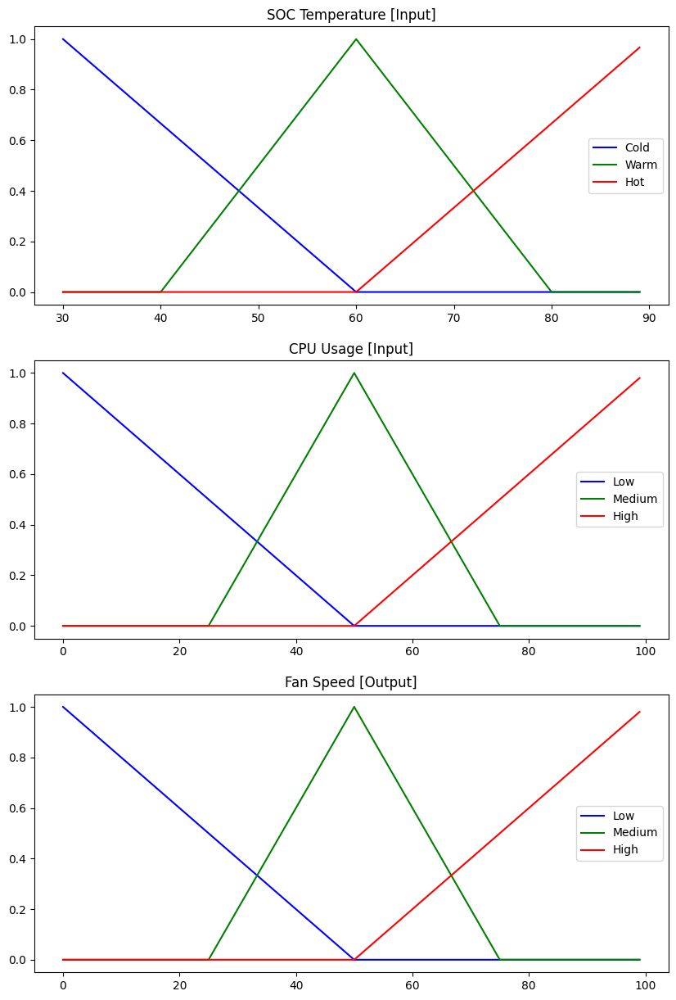

## Fuzzy Pi Fan

**Short story!**

I recently started using a Raspberry Pi 4 as my local file server. It didn't take many days to realize that it was suffering from high temperatures, which were leading to throttling. I immediately had to buy a fan and without much research I bought the official raspberry pi fan. Without further ado the rasbian os does not offer enough control on the fan operation. So I decided to make an app which will control the fan speed through fuzzy logic.

**Raspberry Pi PWM**

Hardware PWM must be enabled in order for this app to work.Activate it by adding an overlay in the /boot/config.txt. Main Raspberry Pi kernel documentation gives 2 possibilities. Either a [single channel](https://github.com/raspberrypi/linux/blob/04c8e47067d4873c584395e5cb260b4f170a99ea/arch/arm/boot/dts/overlays/README#L925), either a [dual channel](https://github.com/raspberrypi/linux/blob/04c8e47067d4873c584395e5cb260b4f170a99ea/arch/arm/boot/dts/overlays/README#L944). For our purpose we will activate only one PWM channel, which exposes the following GPIO pins

| PWM  | GPIO | Function | Alt  | dtoverlay                   |
| ---- | ---- | -------- | ---- | --------------------------- |
| PWM0 | 12   | 4        | Alt0 | dtoverlay=pwm,pin=12,func=4 |
| PWM0 | 18   | 2        | Alt5 | dtoverlay=pwm,pin=18,func=2 |
| PWM1 | 13   | 4        | Alt0 | dtoverlay=pwm,pin=13,func=4 |
| PWM1 | 19   | 2        | Alt5 | dtoverlay=pwm,pin=19,func=2 |

Edit the /boot/config.txt file and add the dtoverlay line in the file. _You need root privileges for this_:

```bash
sudo nano /boot/config.txt
```

Save the file and reboot:

```bash
sudo reboot
```

After rebooting your Pi, you will have access to hardware PWM. A new sysfs directory will be shown uder the following route /sys/class/pwm/pwmchip{num}/pwm{num}, which operates much like the sysfs support for GPIO.

The numbers in brackets (*pwmchip{num} , pwm{num}*) correspond to values of the variables:

```rust
const  BB_PWM_CHIP:  u32  =  0;
const  BB_PWM_NUMBER:  u32  =  0;
```

**Prerequisites**

The app is developed using the Rust programming language and uses the following dependencies:

```toml
[dependencies]
sysfs-pwm = { git = "https://github.com/rust-embedded/rust-sysfs-pwm", branch = "master" }
rsfuzzy={git="https://github.com/auseckas/rsfuzzy",branch = "master"}
```

_(Huge thanks to the creators ❤️)_

**Fuzzy Logic**

The basic idea of this application is to use a fuzzy logic model in order to control the speed of the fan. The temperature of the pi processor is entered as a parameter in the model which then outputs the fan speed. The following plot shows the membership functions:



**Run & Build**

Use cargo in order to run and build the project. **Be sure you have installed the appropriate rust compiler (toolchain)** 
